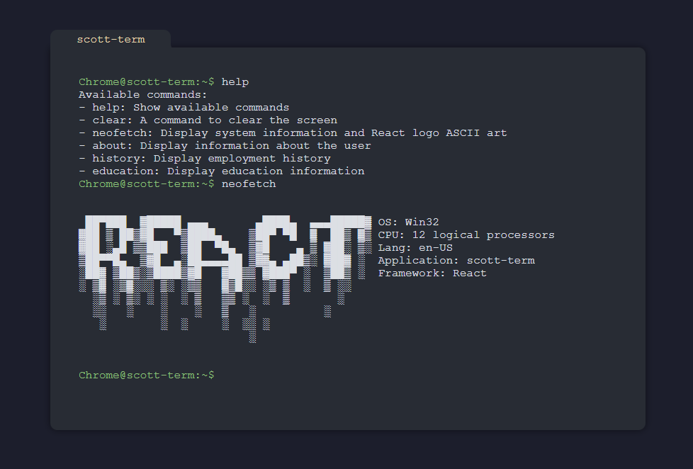

# Personal Portfolio Terminal
This project is a personal portfolio website that mimics a terminal interface. The website is built using React and showcases a unique way to interact with a developer's work and background.

Cobbled together quickly with the help of ChatGPT



## Features

* Terminal-style design for a unique user experience
* Dynamic typing effect to simulate a real terminal environment
* Customizable commands to navigate through the developer's information
* Responsive design for a consistent experience on various devices

## Getting Started

To run the project locally, follow these steps:

### Prerequisites
* Node.js (v12.0.0 or higher)
* npm (v6.0.0 or higher)

### Installation

Clone the repository:
```sh
git clone https://github.com/scott-the-programmer/web.sh.git
```

Install dependencies:
```sh
cd web.sh
npm install
```

Run in dev mode:
```sh
npm run dev
```

The website should now be accessible at http://localhost:5173.

# License
This project is licensed under the MIT License. See the LICENSE file for details.